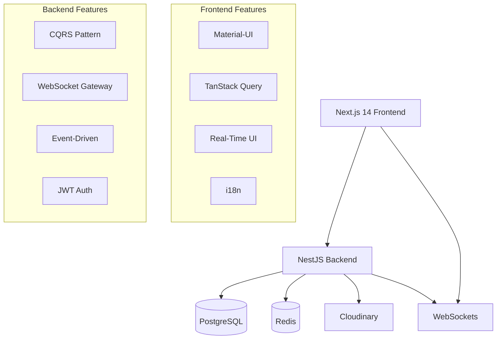

## Blog Platform - FullStack Edition
A complete, production-ready blog platform built with Next.js 14 and NestJS, featuring real-time capabilities, modern architecture patterns, and seamless deployment.

## 🗃️ Project Architecture



## 📦 Repository Structure

- `blog-fullstack/`
  - `🚀 blog-frontend/`         # Next.js 14 client application
  - `⚙️ blog-backend/`          # NestJS API server  
  - `📖 README.md`              # This overview file


## 🚀 Quick Start

## Prerequisites

- **Node.js 18+**
- **Docker & Docker Compose**
- **Git**


## 1. Clone with Submodules

```bash
git clone --recurse-submodules https://github.com/KamilPolojko/blog-fullstack.git
cd blog-fullstack
```
## 2. Details on how to run both projects in development mode are explained in detail in the README.md of these repositories.

- **[FRONTEND](https://github.com/KamilPolojko/blog-frontend-client)**
- **[BACKEND](https://github.com/KamilPolojko/blog-backend)**

## 3. Access Applications

- **Frontend:** http://localhost:3000
- **Backend API:** http://localhost:3001
- **API Docs:** http://localhost:3001/api/docs/client


## 🎯 Quick Navigation

| Application | Description | Detailed Documentation                                                                                      |
| :--- | :--- |:------------------------------------------------------------------------------------------------------------|
| 🌐 Frontend | Next.js 14 with TypeScript, Material-UI, real-time features | [📖 Frontend README](https://github.com/KamilPolojko/blog-frontend-client/blob/main/README.md)                                                                                      |
| ⚙️ Backend | NestJS with CQRS, WebSockets, PostgreSQL, Redis | [📖 Backend README](https://github.com/KamilPolojko/blog-backend/blob/main/README.md)                       |
| 🚀 Live Demo | Production deployment on Vercel & Render | [🌐 Live Application](https://blog-frontend-client.vercel.app)                                              |

## 🛠️ Technology Stack

| Layer | Technologies |
| :--- | :--- |
| 🌐 Frontend | Next.js 14, TypeScript, Material-UI, TanStack Query, Socket.io |
| ⚙️ Backend | NestJS, TypeScript, PostgreSQL, Redis, WebSockets, CQRS |
| 🏗️ Infrastructure | Docker, Vercel, Render, Cloudinary |

## ✨ Core Features

| Feature Area | Description |
| :--- | :--- |
| 📝 Rich Blog System | Articles with categories, rich text editor, image management |
| 💬 Real-Time Interactions | Live comments, likes, notifications via WebSockets |
| 🔐 Secure Authentication | JWT-based auth with profile management |
| 🌍 Internationalization | Multi-language support with auto-detection |
| 📱 Responsive Design | Mobile-first approach with Material-UI |
| ⚡ Performance Optimized | Caching, code splitting, efficient rendering |

## 📊 Production Deployment

| Environment | URL                                                      | Status |
| :--- |:---------------------------------------------------------| :--- |
| 🌐 Frontend | `https://blog-frontend-client.vercel.app`                | ✅ Live |
| ⚙️ Backend API | `https://blog-backend-20zl.onrender.com`                 | ✅ Live |
| 📚 API Documentation | `https://blog-backend-20zl.onrender.com/api/docs/client` | ✅ Live |

## 🎯 Project Highlights

| Aspect | Description |
| :--- | :--- |
| ✅ Full TypeScript | End-to-end type safety across both applications |
| ✅ Real-Time Architecture | WebSocket-powered live updates |
| ✅ Modern Patterns | CQRS, Event-Driven, Component-Based architecture |
| ✅ Production Ready | Dockerized, scalable, fully documented |
| ✅ CI/CD Ready | Automated deployments via Vercel and Render |


## 🔧 Development Workflow

This repository uses Git submodules to maintain separate version control for each application while providing unified development experience.

```bash
# Update all submodules to latest commits
git submodule update --remote

# Commit changes from submodules to repo. 
git add blog-frontend blog-backend
git commit -m "Update submodules to latest versions"
git push origin main

# Work on individual applications
cd blog-frontend    # Frontend development
cd blog-backend     # Backend development
```